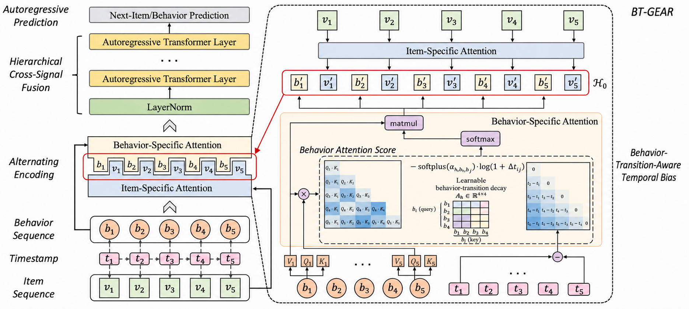
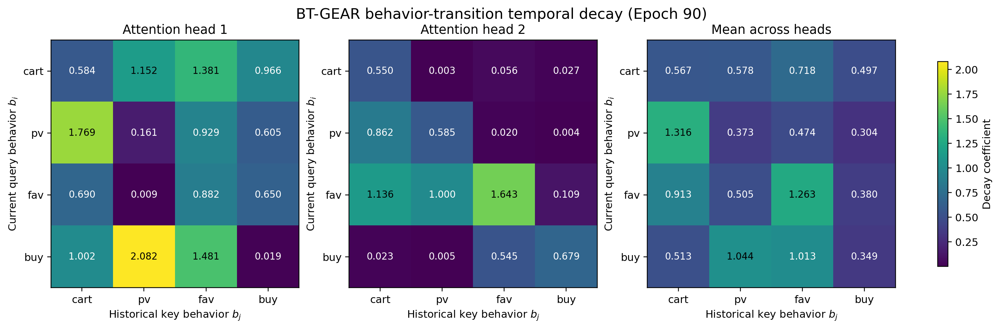

# BT-GEAR: Behavior-Transition-Aware Temporal Decay for GEAR

[English](README.md) | [简体中文](README_zh.md)

BT-GEAR is a research prototype for multi-behavior sequential recommendation. It extends the official implementation of **GEAR: Generalized Alternating Regressor for Multi-Behavior Sequential Recommendation** with a behavior-transition-aware temporal attention bias.

## Architecture



BT-GEAR preserves GEAR's item-attention branch, behavior-attention branch, alternating cross-signal fusion, and autoregressive prediction heads. The architectural change is localized to the temporal bias in behavior-specific attention, where the fixed head-wise coefficient is replaced by a learnable behavior-transition-aware decay matrix.

> **Behavior-count note:** The $4\times4$ matrix in the diagram is the current experimental setting with `n_b=4`, not a hard-coded model limit. For a dataset with $B$ valid behavior types, the general transition matrix is $B\times B$. The implementation allocates one additional row and column for padding index 0.

## Motivation

GEAR models a head-wise temporal decay in its behavior-sequence attention. Its temporal bias can be summarized as

$$
\Phi_{ij}^{(h)}=-\alpha_h\log(1+\Delta t_{ij}),
$$

where the decay coefficient $\alpha_h$ depends on the attention head but not on the behavior types. Consequently, the same head applies the same temporal decay to different transitions such as `pv -> buy`, `cart -> buy`, and `fav -> buy`.

BT-GEAR conditions the decay coefficient on both the current query behavior $b_i$ and the historical key behavior $b_j$:

$$
\Phi_{ij}^{(h)}=-\mathrm{softplus}(\theta_{h,b_i,b_j})\log(1+\Delta t_{ij}).
$$

The `softplus` function keeps every decay coefficient non-negative. The transition parameters are initialized from GEAR's original head-wise slopes, so BT-GEAR starts from the same temporal bias as GEAR and learns transition-specific differences during training.

Only the temporal bias of the lower behavior-attention blocks is changed. The item branch, upper alternating Transformer, prediction heads, and training loss remain unchanged, making the comparison with GEAR controlled and interpretable.

## Ablation Study Design

The ablation study uses four controlled variants. They share the same item branch, behavior branch, alternating Transformer, prediction heads, loss functions, dataset split, and evaluation protocol. Only the parameterization of the temporal decay coefficient is changed.

### GEAR

The original baseline uses one fixed decay coefficient for each attention head:

$$
\Phi_{ij}^{(h)}=-\alpha_h\log(1+\Delta t_{ij}).
$$

The coefficients are not updated by gradient descent and do not depend on the behavior types.

### GEAR-T

GEAR-T replaces the fixed head-wise coefficients with learnable positive coefficients:

$$
\Phi_{ij}^{(h)}=-\mathrm{softplus}(\theta_h)\log(1+\Delta t_{ij}).
$$

This variant tests whether an improvement comes only from making GEAR's temporal slopes trainable.

### BT-GEAR-S

BT-GEAR-S learns one behavior-transition matrix shared by all attention heads:

$$
\Phi_{ij}^{(h)}=-\mathrm{softplus}(\theta_{b_i,b_j})\log(1+\Delta t_{ij}).
$$

The row represents the current query behavior $b_i$, and the column represents the historical key behavior $b_j$. This variant tests whether distinguishing behavior transitions is useful without head-specific matrices. The suffix `S` means that the transition matrix is shared across heads.

### BT-GEAR

The full model learns a separate behavior-transition matrix for every attention head:

$$
\Phi_{ij}^{(h)}=-\mathrm{softplus}(\theta_{h,b_i,b_j})\log(1+\Delta t_{ij}).
$$

Let $H$ denote the number of attention heads and $B$ the number of valid behavior types. The behavior count is supplied through the `n_b` configuration field and is not fixed in the model code.

| Variant | Valid decay coefficients | Stored parameter shape |
|---|---:|---:|
| GEAR-T | $H$ | $[H]$ |
| BT-GEAR-S | $B^2$ | $[B+1,B+1]$ |
| BT-GEAR | $HB^2$ | $[H,B+1,B+1]$ |

For the current experiments, $H=2$ and $B=4$. GEAR-T therefore learns 2 coefficients, BT-GEAR-S has 16 valid behavior-transition entries and 25 stored parameters, and BT-GEAR has 32 valid entries and 50 stored parameters. Entries involving padding are excluded from interpretation and visualization. A dataset with a different number of behaviors can set a different `n_b`, provided that its behavior IDs are mapped consistently from 1 to $B$; checkpoints with incompatible matrix shapes cannot be reused directly.

| Comparison | Question answered |
|---|---|
| GEAR vs. GEAR-T | Does learning the original head-wise temporal slope help? |
| GEAR-T vs. BT-GEAR | Does conditioning decay on the behavior transition add value? |
| BT-GEAR-S vs. BT-GEAR | Is a separate transition matrix for each attention head useful? |
| GEAR vs. BT-GEAR | Does the complete behavior-transition-aware design improve the baseline? |

## Main Files

- `src/models/BTGEAR.py`: behavior-transition-aware temporal decay model.
- `src/models/BTGEARS.py`: behavior-transition matrix shared across attention heads.
- `src/models/GEART.py`: learnable head-wise temporal decay ablation.
- `src/configs/retail_btgear.yaml`: BT-GEAR configuration for the Retail dataset.
- `src/configs/retail_btgear_s.yaml`: BT-GEAR-S configuration for the Retail dataset.
- `src/configs/retail_geart.yaml`: GEAR-T configuration for the Retail dataset.
- `scripts/visualize_transition_decay.py`: checkpoint-to-heatmap visualization script.
- `src/models/GEAR.py`: unchanged upstream GEAR implementation.
- `src/configs/retail.yaml`: memory-safe baseline configuration used on an 8 GB GPU.

## Environment

Install PyTorch for your CUDA version, then install the remaining dependencies:

```bash
pip install -r requirements.txt
pip install -U "jsonargparse[signatures]>=4.27.7"
```

## Dataset

Download the datasets from the [dataset folder provided by the original GEAR repository](https://drive.google.com/drive/folders/1RxTTZtcjdcK063pkRblRxzVDqVZpZX-R?usp=sharing) and place the Retail data at:

```text
data/retail.txt
```

The dataset and generated preprocessing files are intentionally excluded from Git.

## Training

Train the memory-safe GEAR baseline:

```bash
python run.py --config src/configs/retail.yaml fit
```

Train BT-GEAR:

```bash
python run.py --config src/configs/retail_btgear.yaml fit
```

The supplied Retail configurations use `train_batch_size=16` and `accumulate_grad_batches=8`, retaining an effective batch size of 128 while avoiding the full-vocabulary CUDA out-of-memory error on an 8 GB GPU.

To inspect the curves:

```bash
tensorboard --logdir logs --port 6006
```

Then open `http://localhost:6006`.

## Visualizing the Learned Transition Decay

The visualization script automatically loads the newest BT-GEAR checkpoint and exports the per-head matrices, their mean matrix, CSV files, and metadata:

```bash
python scripts/visualize_transition_decay.py \
  --output-dir figures/transition_decay
```

An explicit checkpoint can also be supplied:

```bash
python scripts/visualize_transition_decay.py \
  --checkpoint "path/to/checkpoint.ckpt" \
  --output-dir figures/transition_decay
```

Rows represent the current query behavior $b_i$, while columns represent the historical key behavior $b_j$. A larger coefficient produces faster temporal decay and a stronger attention penalty for an old interaction; a smaller coefficient preserves that transition's influence for longer.

The following heatmaps were extracted from the final archived Retail checkpoint at Epoch 90. Epoch indices are zero-based.



The validation log reaches its best NDCG@10 of 0.728079 at Epoch 78, but that checkpoint was not retained; the archived Epoch 90 checkpoint has NDCG@10 of 0.725703. The figure therefore interprets the final stored model rather than claiming to visualize the exact best-validation checkpoint. Its coefficients vary substantially across behavior transitions and attention heads, from approximately 0.003 to 2.082. In particular, the coefficient for historical `pv` to current `buy` is 2.082 in head 1 but only 0.005 in head 2, showing complementary fast- and slow-decay patterns. The heatmap is an interpretation of learned global parameters rather than evidence of a causal behavioral relationship. The per-head matrices, head mean, and checkpoint metadata are provided in the same figure directory.

## Retail Pre-study Results (Two Seeds)

The final Retail pre-study uses two random seeds (`42` and `2024`). All variants use the same data split and evaluation protocol. Within each seed, the checkpoint with the best validation NDCG@10 is selected, and the table reports the arithmetic mean over the two seeds.

| Model | Mean NDCG@10 | Absolute change vs. GEAR | Relative change vs. GEAR |
|---|---:|---:|---:|
| GEAR | 0.71665 | - | - |
| GEAR-T | 0.71670 | +0.00005 | +0.01% |
| BT-GEAR-S | 0.72456 | +0.00791 | +1.10% |
| **BT-GEAR** | **0.72474** | **+0.00809** | **+1.13%** |

GEAR-T has almost no average gain over GEAR, so the two-seed results do not establish a stable benefit from merely making the original head-wise slopes learnable. Both BT-GEAR-S and BT-GEAR consistently improve the mean result, supporting the value of conditioning temporal decay on behavior transitions. The difference between BT-GEAR and BT-GEAR-S is only `0.00018`, so the additional benefit of using a separate transition matrix for every attention head remains inconclusive. These results support behavior-transition-aware temporal decay as a whole, but they do not justify claiming that every individual component contributes independently. More random seeds, datasets, and statistical significance tests are still needed for a publication-level conclusion.

## Reproducibility Notes

- Training outputs, checkpoints, TensorBoard events, and datasets are excluded by `.gitignore`.
- The Windows-compatible datamodule type annotation and 8 GB GPU configuration changes are included in the repository.
- For an exact resume, pass a checkpoint using `fit --ckpt_path <checkpoint>`; the checkpoint itself is not uploaded.
