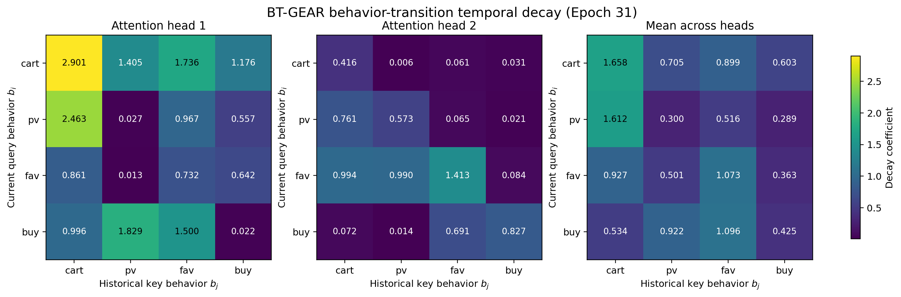

# BT-GEAR：面向 GEAR 的行为转移感知时间衰减

[English](README.md) | [简体中文](README_zh.md)

BT-GEAR 是一个面向多行为序列推荐的研究原型。它在 **GEAR：Generalized Alternating Regressor for Multi-Behavior Sequential Recommendation** 的基础上，引入了行为转移感知的时间注意力偏置。

## 模型架构


BT-GEAR 保留了 GEAR 的物品注意力分支、行为注意力分支、交替式跨信号融合模块和自回归预测头。模型仅修改行为特定注意力中的时间偏置，将固定的注意力头级衰减系数替换为可学习的行为转移感知衰减矩阵。

> **行为数量说明：** 架构图中的 $4\times4$ 矩阵对应当前实验的 `n_b=4` 设置，并不是模型写死的限制。对于包含 $B$ 种有效行为的数据集，通用转移矩阵为 $B\times B$。代码还会为编号 0 的 padding 额外分配一行和一列。

## 研究动机

GEAR 在行为序列注意力中使用注意力头级时间衰减，其时间偏置可表示为：

$$
\Phi_{ij}^{(h)}=-\alpha_h\log(1+\Delta t_{ij}),
$$

其中，衰减系数 $\alpha_h$ 只取决于注意力头，而不区分行为类型。因此，同一个注意力头会对 `pv -> buy`、`cart -> buy` 和 `fav -> buy` 等不同的行为转移应用相同的时间衰减。

BT-GEAR 同时根据当前查询行为 $b_i$ 和历史键行为 $b_j$ 确定衰减系数：

$$
\Phi_{ij}^{(h)}=-\mathrm{softplus}(\theta_{h,b_i,b_j})\log(1+\Delta t_{ij}).
$$

`softplus` 函数保证所有衰减系数均为非负值。行为转移参数由 GEAR 原始的注意力头级斜率初始化，因此 BT-GEAR 在训练开始时具有与 GEAR 相同的时间偏置，并在训练过程中逐渐学习不同转移对应的特定衰减规律。

模型只改变底层行为注意力模块中的时间偏置。物品分支、上层交替 Transformer、预测头和训练损失均保持不变，使 BT-GEAR 与 GEAR 之间的比较更加受控且易于解释。

## 消融实验设计

消融实验包含四个受控模型。四个模型使用相同的物品分支、行为分支、交替 Transformer、预测头、损失函数、数据划分和评测方式，只改变时间衰减系数的参数化方法。

### GEAR

原始基线为每个注意力头设置一个固定的时间衰减系数：

$$
\Phi_{ij}^{(h)}=-\alpha_h\log(1+\Delta t_{ij}).
$$

这些系数不参与梯度更新，也不区分行为类型。

### GEAR-T

GEAR-T 将固定的注意力头级系数改成可学习的非负系数：

$$
\Phi_{ij}^{(h)}=-\mathrm{softplus}(\theta_h)\log(1+\Delta t_{ij}).
$$

该模型用于检验性能提升是否仅来自“让 GEAR 原有的时间斜率参与训练”。

### BT-GEAR-S

BT-GEAR-S 学习一张由所有注意力头共享的行为转移矩阵：

$$
\Phi_{ij}^{(h)}=-\mathrm{softplus}(\theta_{b_i,b_j})\log(1+\Delta t_{ij}).
$$

矩阵的行表示当前查询行为 $b_i$，列表示历史键行为 $b_j$。该模型用于检验在不区分注意力头的情况下，显式区分行为转移是否有效。后缀 `S` 表示所有注意力头共享同一张转移矩阵。

### BT-GEAR

完整 BT-GEAR 为每个注意力头分别学习一张行为转移矩阵：

$$
\Phi_{ij}^{(h)}=-\mathrm{softplus}(\theta_{h,b_i,b_j})\log(1+\Delta t_{ij}).
$$

设 $H$ 为注意力头数量，$B$ 为有效行为类型数量。行为数量由配置中的 `n_b` 提供，并未固定在模型代码中。

| 模型 | 有效衰减系数数量 | 代码实际参数形状 |
|---|---:|---:|
| GEAR-T | $H$ | $[H]$ |
| BT-GEAR-S | $B^2$ | $[B+1,B+1]$ |
| BT-GEAR | $HB^2$ | $[H,B+1,B+1]$ |

当前实验使用 $H=2$ 和 $B=4$。因此，GEAR-T 学习 2 个系数；BT-GEAR-S 包含 16 个有效行为转移参数，代码实际保存 25 个参数；完整 BT-GEAR 包含 32 个有效参数，代码实际保存 50 个参数。解释和可视化时不包含与 padding 有关的条目。如果其他数据集具有不同数量的行为，可以修改 `n_b`，但必须保证数据中的行为编号与 1 到 $B$ 一致；矩阵尺寸不兼容时不能直接复用原检查点。

| 对比组合 | 回答的问题 |
|---|---|
| GEAR vs. GEAR-T | 让原始注意力头级时间斜率参与训练是否有效？ |
| GEAR-T vs. BT-GEAR | 根据行为转移确定衰减系数是否带来额外价值？ |
| BT-GEAR-S vs. BT-GEAR | 每个注意力头使用独立转移矩阵是否有用？ |
| GEAR vs. BT-GEAR | 完整的行为转移感知方案能否提升原始基线？ |

## 主要文件

- `src/models/BTGEAR.py`：行为转移感知时间衰减模型。
- `src/models/BTGEARS.py`：所有注意力头共享行为转移矩阵的消融模型。
- `src/models/GEART.py`：可学习注意力头级时间衰减消融模型。
- `src/configs/retail_btgear.yaml`：Retail 数据集上的 BT-GEAR 配置。
- `src/configs/retail_btgear_s.yaml`：Retail 数据集上的 BT-GEAR-S 配置。
- `src/configs/retail_geart.yaml`：Retail 数据集上的 GEAR-T 配置。
- `scripts/visualize_transition_decay.py`：从检查点生成衰减矩阵热力图的脚本。
- `src/models/GEAR.py`：原始 GEAR 模型实现。
- `src/configs/retail.yaml`：适用于 8 GB 显存的基线配置。

## 环境配置

首先安装与你的 CUDA 版本匹配的 PyTorch，然后安装其余依赖：

```bash
pip install -r requirements.txt
pip install -U "jsonargparse[signatures]>=4.27.7"
```

## 数据集

从 [GEAR 数据集文件夹](https://drive.google.com/drive/folders/1RxTTZtcjdcK063pkRblRxzVDqVZpZX-R?usp=sharing) 下载数据集，并将 Retail 数据放置在：

```text
data/retail.txt
```

数据集和预处理生成的文件不会提交到 Git。

## 模型训练

训练显存友好的 GEAR 基线：

```bash
python run.py --config src/configs/retail.yaml fit
```

训练 BT-GEAR：

```bash
python run.py --config src/configs/retail_btgear.yaml fit
```

提供的 Retail 配置使用 `train_batch_size=16` 和 `accumulate_grad_batches=8`，在保持等效批大小为 128 的同时，避免在 8 GB 显卡上计算完整物品词表时出现 CUDA 显存不足错误。

查看训练曲线：

```bash
tensorboard --logdir logs --port 6006
```

随后打开 `http://localhost:6006`。

## 可视化行为转移衰减

可视化脚本会自动加载最新的 BT-GEAR 检查点，并导出各注意力头的衰减矩阵、平均矩阵、CSV 文件和元数据：

```bash
python scripts/visualize_transition_decay.py \
  --output-dir figures/transition_decay
```

也可以显式指定检查点：

```bash
python scripts/visualize_transition_decay.py \
  --checkpoint "path/to/checkpoint.ckpt" \
  --output-dir figures/transition_decay
```

矩阵的行表示当前查询行为 $b_i$，列表示历史键行为 $b_j$。系数越大，时间衰减越快，旧交互受到的注意力惩罚越强；系数越小，该行为转移的影响保留得越久。

下图为从 Retail 数据集第 31 个 Epoch 检查点中提取的热力图：



在该检查点中，不同行为转移和注意力头对应的系数存在明显差异，取值约为 0.006 至 2.901。这说明模型已经偏离与行为类型无关的初始状态，并学习到了注意力头特定的行为转移模式。热力图用于解释模型学到的参数，不能作为行为之间存在因果关系的证据。

## 初步实验结果

下表报告 Retail 数据集在单个随机种子（`seed=42`）下完成的预研实验。所有模型使用相同的数据划分和评测协议，每一行均报告根据验证集 NDCG@10 选择的最佳检查点；Epoch 从 0 开始编号。

| 模型 | 最佳 Epoch | NDCG@1 | NDCG@5 | NDCG@10 | Recall@5 | Recall@10 |
|---|---:|---:|---:|---:|---:|---:|
| GEAR | 80 | 0.606951 | 0.696784 | 0.715395 | 0.773137 | 0.830635 |
| GEAR-T | 49 | 0.608516 | 0.702169 | 0.720023 | 0.781388 | 0.836617 |
| BT-GEAR-S | 62 | 0.618110 | 0.704820 | 0.723470 | 0.779890 | 0.837310 |
| **BT-GEAR** | **78** | **0.619310** | **0.710020** | **0.728080** | **0.788080** | **0.843930** |

与根据 NDCG@10 选择的原始 GEAR 检查点相比，完整 BT-GEAR 的提升如下：

| 指标 | 绝对提升 | 相对提升 |
|---|---:|---:|
| NDCG@1 | +0.012359 | +2.04% |
| NDCG@5 | +0.013236 | +1.90% |
| NDCG@10 | +0.012685 | +1.77% |
| Recall@5 | +0.014943 | +1.93% |
| Recall@10 | +0.013295 | +1.60% |

完整 BT-GEAR 在五项指标上均优于 GEAR。GEAR-T 和 BT-GEAR-S 的 NDCG@10 也超过原始基线，为可学习时间衰减、行为转移条件化和注意力头特异转移矩阵的作用提供了受控的初步证据。当前结果仍来自单个随机种子，形成论文级结论前还需要补充更多随机种子、数据集和统计显著性检验。

## 可复现性说明

- 训练输出、检查点、TensorBoard 事件文件和数据集均由 `.gitignore` 排除。
- 仓库包含兼容 Windows 的数据模块类型标注修改和适用于 8 GB 显存的配置。
- 如需精确恢复训练，请通过 `fit --ckpt_path <checkpoint>` 指定检查点；检查点文件本身不会上传。
